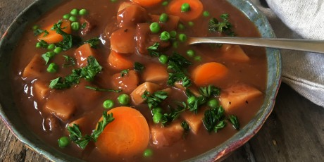

# Beef stew

| Info      | Amount     |
| --------- | ---------- |
| Prep Time | 20 min     |
| Cook Time | 7 h        |
| Yields    | 4 servings |

Added: 2018-02-03

Tags: #stew #soup #beef #dinner

## Ingredients

| Quantity | Item                                                                |
| -------- | ------------------------------------------------------------------- |
| 2 lbs    | [beef chuck](../Ingredients/beef-chuck.md), cut into 1" pieces      |
| 1/4 cup  | [flour](../Ingredients/flour.md)                                    |
| 3 Tbsp   | [canola oil](../Ingredients/canola%20oil.md)                        |
| 1        | [carrots](../Ingredients/carrot.md)                                 |
| 1        | [onion](../Ingredients/onion.md)                                    |
| 2 cloves | [garlic](../Ingredients/garlic.md), minced                          |
| 12 oz    | [stout beer](../Ingredients/stout-beer.md), (eg. Guinness), divided |
| 3/2 cups | [chicken stock](../Ingredients/chicken-stock.md)                    |
| 1        | [Yukon gold potato](../Ingredients/potato.md), cut into 1" chunks   |
| 3 sprigs | [thyme](../Ingredients/thyme.md)                                    |
| 2 Tbsp   | [molasses](../Ingredients/molasses.md)                              |
| 1 Tbsp   | [tomato paste](../Ingredients/tomato%20paste.md)                    |
| 1 tsp    | [salt](../Ingredients/salt.md)                                      |
| 1/2 cup  | [frozen peas](../Ingredients/frozen-peas.md)                        |
| 1/2 cup  | fresh [parsley](../Ingredients/parsley.md), chopped                 |
|          | [salt](../Ingredients/salt.md)                                      |
|          | [pepper](../Ingredients/pepper.md)                                  |

## Directions

1. Season the beef with salt and pepper then dredge in flour
2. In a large skillet set over high, heat 1 Tbsp of the canola oil
    1. Sear beef in a single layer in skillet until deep brown on all sides, about 10 to 12 minutes
    2. Remove beef from pan and place in the pot of a 4-quart slow cooker
3. Add the remaining oil to the skillet
    1. Add carrot, onion and garlic
    2. Cook until vegetables are fragrant and beginning to brown, about 3 minutes
    3. Pour half the beer over vegetables
    4. Using a wooden spoon, scrape the bottom of the pan, lifting any brown bits
4. Add contents of the pan into slow cooker
    1. Pour in remaining beer and stock and add in potatoes, thyme, molasses, tomato paste and salt
    2. Stir to combine
    3. Cover slow cooker and cook on low for 7 hours
5. During the last 10 min of cooking, stir in green peas
6. Discard thyme sprigs. Serve, garnished with fresh parsley.

## References & Notes

1. [Original recipe](http://www.foodnetwork.ca/recipe/slow-cooker-canadian-stout-and-alberta-beef-stew/20790/)
