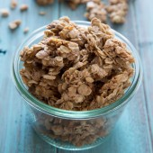

# Cinnamon Maple Granola

| Info      | Amount  |
| --------- | ------- |
| Prep Time | 5 mins  |
| Cook Time | 35 mins |
| Yields    | 4 cups  |

Added: 2019-05-21

Tags: #cereal #granola #baking

## Ingredients

| Quantity | Item                                                   |
| -------- | ------------------------------------------------------ |
| 4 cups   | [oats](../Ingredients/oats.md)                         |
| 2 tsp    | [cinnamon](../Ingredients/cinnamon.md)                 |
| 1/2 cup  | [pure maple syrup](../Ingredients/maple%20syrup.md)    |
| 1/3 cup  | [olive oil](../Ingredients/olive%20oil.md)             |
| 3/2 tsp  | [vanilla extract](../Ingredients/vanilla%20extract.md) |

## Directions

1. Preheat oven to 325 F
   1. Prepare a large rimmed baking sheet with parchment paper or a silicone baking mat.
2. In a large bowl, combine all ingredients. Stir to coat well.
3. Transfer oatmeal mixture to prepared baking sheet.
   1. Spread out into an even layer, pressing down to compress the mixture.
4. Bake for 35-40 minutes
   1. Remove from oven and cool, untouched, for 45 minutes
   2. Break into pieces
   3. Store in an airtight container for up to 2 weeks.

## References

1. [Original recipe](https://www.bakedbyrachel.com/cinnamon-maple-granola/)
