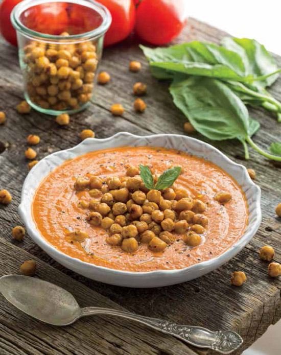

# Cream of tomato soup

| Info      | Amount     |
| --------- | ---------- |
| Prep Time | 30 min     |
| Cook Time | 15 min     |
| Yields    | 4 servings |

Added: 2018-04-07

Tags: #soup #vegetarian #vegan

## Ingredients

### Chickpea croutons

| Quantity | Item                                                      |
| -------- | --------------------------------------------------------- |
| 15 oz    | [chickpeas](../Ingredients/chickpeas.md), drained, rinsed |
| 1 tsp    | [olive oil](../Ingredients/olive%20oil.md)                |
| 1/2 tsp  | dried [oregano](../Ingredients/oregano.md)                |
| 1/8 tsp  | [cayenne pepper](../Ingredients/cayenne%20pepper.md)      |
| 1 tsp    | [garlic powder](../Ingredients/garlic-powder.md)          |
| 1/4 tsp  | [onion powder](../Ingredients/onion-powder.md)            |
| 1 tsp    | fine grain sea [salt](../Ingredients/salt.md)             |

### Tomato soup

| Quantity | Item                                                                             |
| -------- | -------------------------------------------------------------------------------- |
| 1 Tbsp   | [olive oil](../Ingredients/olive%20oil.md)                                       |
| 1        | [yellow onion](../Ingredients/yellow-onion.md), diced                            |
| 2 cloves | [garlic](../Ingredients/garlic.md), minced                                       |
| 1/2 cup  | [cashews](../Ingredients/cashews.md), soaked                                     |
| 2 cups   | [vegetable broth](../Ingredients/vegetable%20broth.md)                           |
| 28 oz    | [whole peeled tomatoes](../Ingredients/whole%20peeled%20tomatoes.md) with juices |
| 1/4 cup  | oil-packed [sundried tomatoes](../Ingredients/sundried-tomatoes.md)              |
| 2 oz     | [tomato paste](../Ingredients/tomato%20paste.md)                                 |
| 1 tsp    | dried [oregano](../Ingredients/oregano.md)                                       |
| 1 tsp    | fine grain sea [salt](../Ingredients/salt.md)                                    |
| 1 tsp    | [pepper](../Ingredients/pepper.md)                                               |
| 1/2 tsp  | dried [thyme](../Ingredients/thyme.md)                                           |

### Garnish

* fresh [basil](../Ingredients/basil.md)
* [olive oil](../Ingredients/olive%20oil.md)
* [pepper](../Ingredients/pepper.md)

## Directions

1. Preheat the oven to 425 F (220 C)
2. Remove skins from the chickpeas
   1. Line a large rimmed baking sheet with paper towels
   2. Place the chickpeas on the paper towels and place a couple paper towels on top
   3. Roll them around until any liquid on them has been absorbed
   4. Discard paper towels
3. Transfer the chickpeas to a large bowl and stir in the grapeseed oil, oregano, cayenne, garlic powder, onion powder, and salt
   1. Line the baking sheet with parchment paper and then spread the chickpeas in an even layer
4. Bake for 15 minutes
   1. Give the pan a shake and cook for 15 to 20 minutes more until the chickpeas are lightly charred and golden
5. Let cool on the baking sheet for at least 5 minutes. They will crisp up as they cool
6. While chickpeas are baking, brown minced garlic and onion
   1. In a large saucepan, heat the olive oil over medium heat
   2. Add the onion and garlic and sauté for 5 to 6 minutes, or until the onion is translucent
7. In a blender, combine the soaked cashews and the broth and blend on high speed until creamy and smooth
   1. Add the garlic-onion mixture, the tomatoes and their juices, sun-dried tomatoes, and tomato paste and blend on high until smooth
8. Pour the tomato mixture into the saucepan in which you cooked the onions and set the pan over med-high heat
   1. Bring the mixture to a simmer, then stir in the oregano, salt, pepper to taste, and thyme
9. Gently simmer over medium heat, uncovered, for 20 to 30 minutes, until the flavors have developed
10. Ladle the soup into bowls and top with 1/3 - 1/2 cup of the chickpea croutons
    1. Garnish with minced fresh basil leaves, a drizzle of olive oil, and freshly ground black pepper

## References & Notes

1. [Original recipe](http://www.styleathome.com/food-and-drink/recipes/article/recipe-cream-of-tomato-soup-with-roasted-italian-chickpea-croutons)