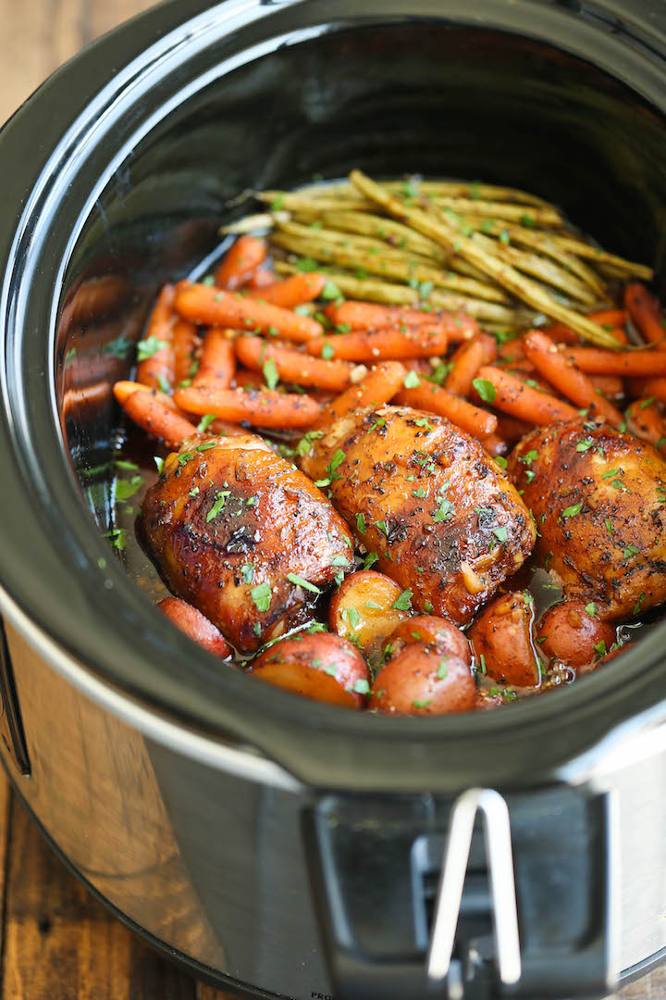

# Honey garlic chicken and veggies

| Info      | Amount     |
| --------- | ---------- |
| Prep Time | 10 min     |
| Cook Time | 4 h        |
| Yields    | 4 servings |

Added: 2019-12-07

Tags: #slow-cooker #diner

## Ingredients

### Main

| Quantity | Item                                                        |
| -------- | ----------------------------------------------------------- |
| 4        | [chicken breasts](../Ingredients/chicken%20breast.md)         |
| 16 oz    | baby [red potatoes](../Ingredients/red-potatoes.md), halved |
| 16 oz    | baby [carrots](../Ingredients/carrot.md)                    |
| 16 oz    | [green beans](../Ingredients/green%20beans.md), trimmed       |
| 2 Tbsp   | [parsley](../Ingredients/parsley.md), chopped               |

### Sauce

| Quantity | Item                                                     |
| -------- | -------------------------------------------------------- |
| 1/2 cup  | [soy sauce](../Ingredients/soy%20sauce.md)                 |
| 1/2 cup  | [honey](../Ingredients/honey.md)                         |
| 1/4 cup  | [ketchup](../Ingredients/ketchup.md)                     |
| 2 cloves | [garlic](../Ingredients/garlic.md), minced               |
| 1 tsp    | [basil](../Ingredients/basil.md)                         |
| 1/2 tsp  | [oregano](../Ingredients/oregano.md)                     |
| 1/4 tsp  | [red pepper flakes](../Ingredients/red pepper flakes.md) |
| 1/4 tsp  | [pepper](../Ingredients/pepper.md)                       |

## Directions

1. In a large bowl, combine soy sauce, honey, ketchup, garlic, basil, oregano, red pepper flakes and pepper.
2. Place chicken thighs, potatoes, carrots and soy sauce mixture into slow cooker
   1. Cover and cook on high heat for 4h or low for 8 h
   2. Baste every hour
   3. Add green beans during the last 30 minutes of cooking time
3. OPTIONAL: Preheat oven to broil. Place chicken thighs onto a baking sheet, skin side up, and broil until crisp, about 3-4 min.
4. Serve chicken immediately with potatoes, carrots and green beans, garnished with parsley, if desired.

## References & Notes

1. [Original recipe](https://damndelicious.net/2015/06/05/slow-cooker-honey-garlic-chicken-and-veggies/)
