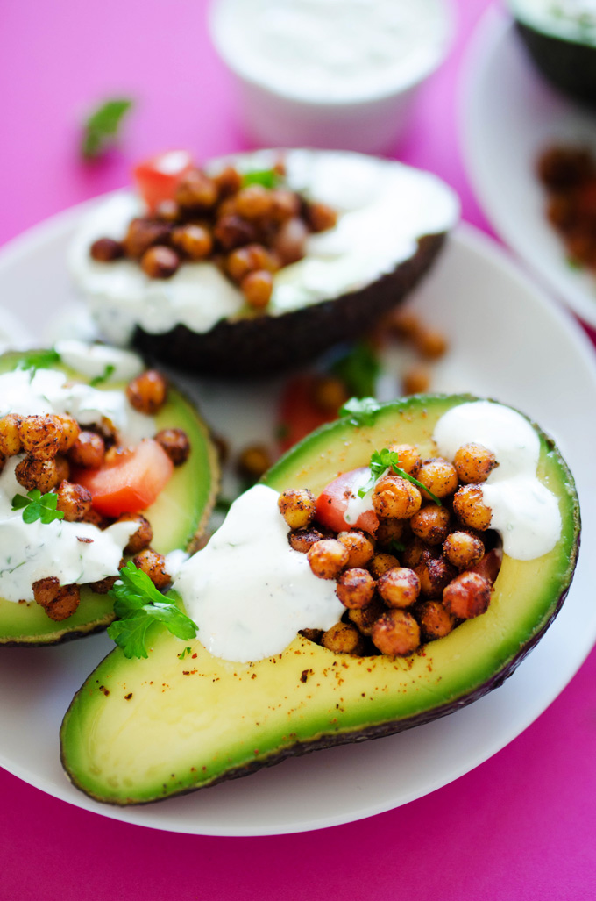

# Roasted chickpea stuffed avocadoes

| Info      | Amount     |
| --------- | ---------- |
| Prep Time | 10 min     |
| Cook Time | 20 min     |
| Yields    | 2 servings |

Added: 2017-08-22

Tags: #vegetarian #avocado #dinner

## Ingredients

### Roasted chickpeas

| Quantity | Item                                                      |
| -------- | --------------------------------------------------------- |
| 15 oz    | [chickpeas](../Ingredients/chickpeas.md), drained, rinsed |
| 1 Tbsp   | [olive oil](../Ingredients/olive%20oil.md)                |
| 2 tsp    | smoked [paprika](../Ingredients/paprika.md)               |
| 1 tsp    | [pepper](../Ingredients/pepper.md)                        |
| 1/2 tsp  | [cayenne pepper](../Ingredients/cayenne%20pepper.md)      |
| 1/2 tsp  | [salt](../Ingredients/salt.md)                            |
| 4        | ripe [avocadoes](../Ingredients/avocado.md)               |
| 1/2      | [tomato], diced                                           |
| 1        | [lemon](../Ingredients/lemon.md)                          |

### Yogurt sauce

| Quantity | Item                                                   |
| -------- | ------------------------------------------------------ |
| 1/4 cup  | plain [Greek yogurt](../Ingredients/greek%20yogurt.md) |
| 1 clove  | [garlic](../Ingredients/garlic.md), minced             |
| 2 Tbsp   | [parsley](../Ingredients/parsley.md), chopped          |
|          | [pepper](../Ingredients/pepper.md)                     |

## Directions

1. Preheat oven to 400 F
2. Pour chickpeas onto paper towels to pat dry, rolling to remove skins
   1. In a medium sized bowl, mix chickpeas, olive oil, and spices
   2. Spread chickpeas onto parchment lined baking sheet
   3. Cook for 20 min in the oven
3. Combine all dressing ingredients in a small bowl
4. When chickpeas have finished cooking, slice avocados in half, fill with chickpeas, drizzle with lemon juice, and sprinkle with salt and pepper
5. Serve in a bowl with diced tomato and a dollop of the yogurt sauce
