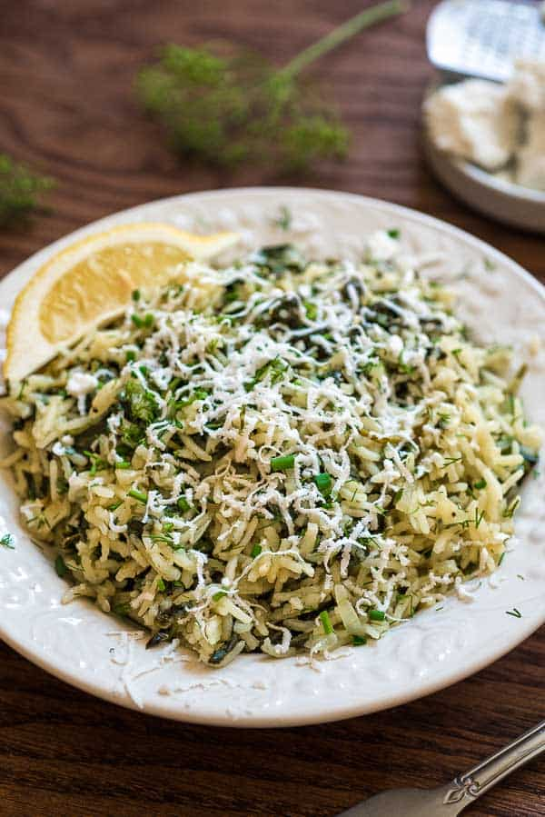

# Spanakorizo rice

| Info      | Amount     |
| --------- | ---------- |
| Prep Time | 5 min      |
| Cook Time | 35 min     |
| Yields    | 6 servings |

Added: 2020-04-16

Tags: #vegetarian #rice #dinner

## Ingredients

| Quantity | Item                                                                                                |
| -------- | --------------------------------------------------------------------------------------------------- |
| 3 Tbsp   | [olive oil](../Ingredients/olive%20oil.md)                                                          |
| 1        | medium [onion](../Ingredients/onion.md), chopped                                                    |
| 4 cloves | [garlic](../Ingredients/garlic.md), chopped                                                         |
| 4 Tbsp   | [chives](../Ingredients/chives.md) or [scallions](../Ingredients/scallions.md), chopped and divided |
| 4 Tbsp   | [dill](../Ingredients/dill.md)                                                                      |
| 1/2 lbs  | baby [spinach](../Ingredients/spinach.md)                                                           |
| 1 cup    | basmati [rice](../Ingredients/rice.md)                                                              |
| 2 cup    | [vegetable broth](../Ingredients/vegetable%20broth.md)                                              |
| 3 Tbsp   | [butter](../Ingredients/butter.md)                                                                  |
| 2 Tbsp   | [lemon juice](../Ingredients/lemon%20juice.md)                                                      |
| 2 tsp    | [lemon zest](../Ingredients/lemon.md)                                                               |
|          | [feta](../Ingredients/feta.md)                                                                      |

## Directions

1. Heat olive oil in large pot over medium-high heat
   1. Saute onions
   2. Add garlic, half the dill and chives
   3. Saute for another minute
2. Add spinach, cook until wilted
   1. Add salt, rice, and broth
   2. Stir, bring to a boil, cover, reduce heat to medium-low
   3. Simmer for 20 min
3. Stir in butter, lemon juice, lemon zest, and remaining chives and dill
4. Garnish with feta, serve with lemon wedges

## References & Notes

1. [Original recipe](https://cooktoria.com/spanakorizo-greek-spinach-rice/#wprm-recipe-container-5934)
