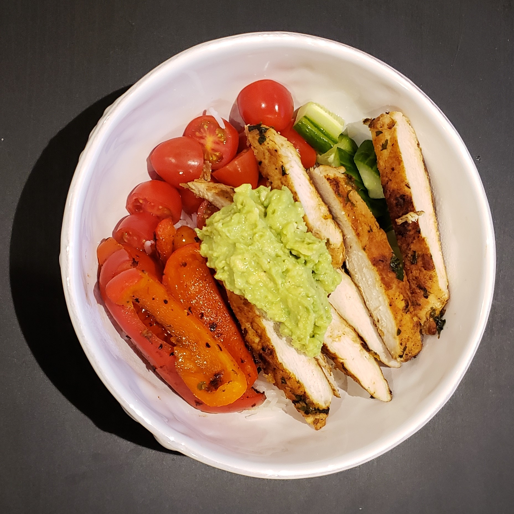

# Sweet potato burrito bowl

| Info      | Amount     |
| --------- | ---------- |
| Prep Time | 10 min     |
| Cook Time | 30 min     |
| Yields    | 4 servings |

Added: 2021-03-03

Tags: #dinner #potato #vegan

## Ingredients

| Quantity | Item                                                   |
| -------- | ------------------------------------------------------ |
| 1        | large [sweet potato](../Ingredients/sweet%20potato.md) |
| 2        | [bell peppers](../Ingredients/bell%20pepper.md)        |
| 1        | small [red onion](../Ingredients/red%20onion.md)       |
| 1 tsp    | [paprika](../Ingredients/paprika.md)                   |
| 2 Tbsp   | [olive oil](../Ingredients/olive%20oil.md)             |
| 1/2 cup  | [rice](../Ingredients/rice.md)                         |
| 14 oz    | [black beans](../Ingredients/black%20beans.md)         |
| 1 cup    | cooked [corn](../Ingredients/corn.md)                  |
| 1        | [avocado](../Ingredients/avocado.md)                   |
|          | [salt](../Ingredients/salt.md)                         |
|          | [pepper](../Ingredients/pepper.md)                     |

## Directions

1. Preheat oven to 400 F
2. Chop sweet potato into chunks
    1. Slice peppers and onion into long, thin strips
    2. Toss vegetables with olive oil, paprika, salt, and pepper
    3. Place on a lined baking sheet and cook for 25 - 30 min, until potatoes are tender
3. While the vegetables are roasting, cook the rice
4. With 5 min left on the vegetables, drain and rinse black beans
    1. Transfer to a pan, add salt, pepper, paprika, corn, and olive oil to heat up
5. Mix black beans with roasted vegetables and serve on a bed of rice in each bowl
6. Garnish with sliced avocado and a dressing of olive oil, lemon juice, and minced garlic

## References & Notes

1. [Original recipe](https://eatwithclarity.com/wprm_print/7645)
