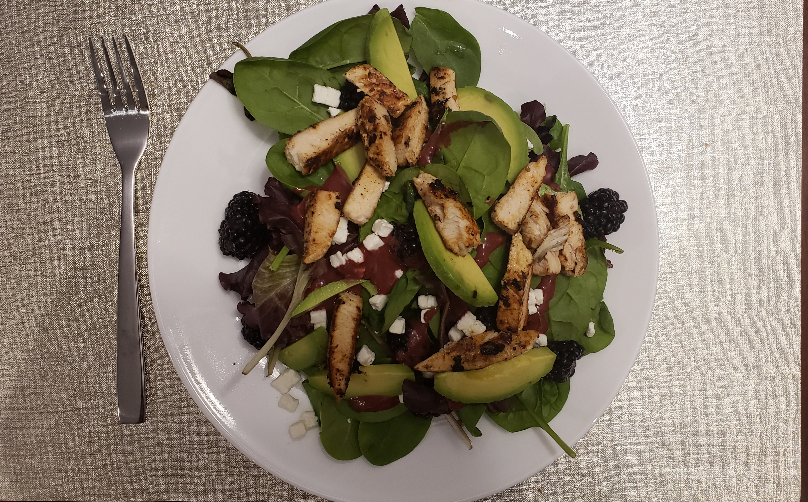

# Blackberry balsamic chicken salad

| Info      | Amount     |
| --------- | ---------- |
| Prep Time | 30 min     |
| Cook Time | 10 min     |
| Yields    | 4 servings |

Added: 2019-08-12

Tags: #salad #chicken #lunch #dinner

## Ingredients

### Vinaigrette

| Quantity | Item                                                      |
| -------- | --------------------------------------------------------- |
| 1/2 cup  | [blackberries](../_ingredients/blackberry.md)             |
| 2 Tbsp   | [balsamic vinegar](../_ingredients/balsamic%20vinegar.md) |
| 2 Tbsp   | [olive oil](../_ingredients/olive%20oil.md)               |
| 2 Tbsp   | [honey](../_ingredients/honey.md)                         |
| 2 tsp    | [dijon mustard](../_ingredients/dijon%20mustard.md)       |
| 1 tsp    | [soy sauce](../_ingredients/soy%20sauce.md)               |
| 1 clove  | [garlic](../_ingredients/garlic.md), minced               |
|          | [salt](../_ingredients/salt.md)                           |
|          | [pepper](../_ingredients/pepper.md)                       |

### Cheese

| Quantity | Item                                                                    |
| -------- | ----------------------------------------------------------------------- |
| 8 oz     | [goat cheese](../_ingredients/goat%20cheese.md), sliced into 1/4" discs |
| 1/4 cup  | [flour](../_ingredients/flour.md)                                       |
| 1        | [egg](../_ingredients/egg.md), lightly beaten                           |
| 1 cup    | [breadcrumbs](../_ingredients/breadcrumbs.md)                           |

### Salad

| Quantity | Item                                                                                                                         |
| -------- | ---------------------------------------------------------------------------------------------------------------------------- |
| 1/2 lbs  | [chicken breasts](../_ingredients/chicken%20breast.md)                                                                       |
| 6 cups   | [lettuce](../_ingredients/lettuce.md) or [spinach](../_ingredients/spinach.md)                                               |
| 1 cup    | [blackberries](../_ingredients/blackberry.md)                                                                                |
| 1 cup    | [avocado](../_ingredients/avocado.md)                                                                                        |
| 1/4 cup  | [red onion](../_ingredients/red%20onion.md), sliced                                                                          |
| 1/4 cup  | [walnuts](../_ingredients/walnuts.md), [pistachios](../_ingredients/pistachios.md), or [almonds](../_ingredients/almonds.md) |

## Directions

1. Puree vinaigrette ingredients in a blender, store separately
2. Dredge goat cheese slices in the flower
   1. Coat with eggs, then breadcrumbs
   2. Fry in oil over medium heat until golden
   3. Set aside on paper towels to drain
3. Marinate chicken in half of the vinaigrette for 30 min
   1. Grill over medium-high heat until slightly charred
4. Assemble all ingredients and serve

## References & Notes

1. [Original recipe](https://www.closetcooking.com/blackberry-balsamic-grilled-chicken/)
