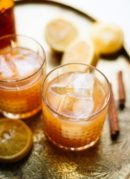

# Cinnamon maple whiskey sour

Added: 2020-10-09

Tags: #alcoholic #beverage

## Ingredients

| Quantity | Item                                                 |
| -------- | ---------------------------------------------------- |
| 1.5 oz   | [bourbon](../Ingredients/bourbon.md)                 |
| 1 oz     | fresh [lemon juice](../Ingredients/lemon%20juice.md) |
| 1 Tbsp   | [maple syrup](../Ingredients/maple%20syrup.md)       |
|          | [ice cubes](../Ingredients/ice-cubes.md)             |

## Directions

1. Fill a cocktail shaker with ice cubes
2. Add all ingredients and shake until frothy
3. Fill cocktail glass with ice, pour drink over top and serve

## References & Notes

1. [Original recipe](https://cookieandkate.com/cinnamon-maple-whiskey-sour-recipe/print/24019/)
