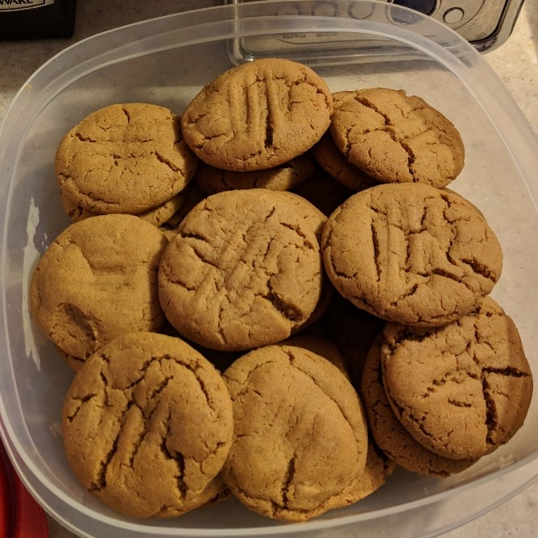

# Gingersnaps

| Info      | Amount     |
| --------- | ---------- |
| Prep Time | 15 min     |
| Cook Time | 10 min     |
| Yields    | 36 cookies |

Added: 2018-12-18

Tags: #cookies #dessert

## Ingredients

| Quantity | Item                                                   |
| -------- | ------------------------------------------------------ |
| 1 cup    | [sugar](../_ingredients/sugar.md)                      |
| 3/4 cup  | [shortening](../_ingredients/shortening.md)            |
| 1/4 cup  | Crosby's fancy [molasses](../_ingredients/molasses.md) |
| 1        | [egg](../_ingredients/egg.md)                          |
| 2 cup    | [flour](../_ingredients/flour.md)                      |
| 2 tsp    | [baking soda](../_ingredients/baking%20soda.md)        |
| 1/2 tsp  | [table salt](../_ingredients/table%20salt.md)          |
| 1/2 tsp  | [cinnamon](../_ingredients/cinnamon.md)                |
| 1/4 tsp  | ground [cloves](../_ingredients/cloves.md)             |
| 1/4 tsp  | ground [ginger](../_ingredients/ginger.md)             |

## Directions

1. Grease cookies sheets
2. In large bowl, combine sugar, shortening, molasses, and egg
     1. Blend well
3. Mix remaining ingredients together in a smaller bowl
    1. Blend with creamed mixture
    2. If desired, chill dough for easier handling
4. Shape into 1" balls
    3. Roll each in white sugar, if desired
    4. Place 2" apart on cookie sheet
    5. Press down lightly with a wet fork
5. Bake for 10 min at 350 F or until edges are set
    6. Let sit on cookie sheet for 5 min before removing to cool on rack
