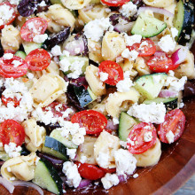

# Greek tortellini salad

| Info      | Amount     |
| --------- | ---------- |
| Prep Time | 15 min     |
| Cook Time | 0 min      |
| Yields    | 4 servings |

Added: 2017-01-21

Tags: #vegetarian #salad #dinner

## Ingredients

### Salad

| Quantity | Item                                                                             |
| -------- | -------------------------------------------------------------------------------- |
| 20 oz    | [tortellini](../_ingredients/tortellini.md)                                      |
| 3/2 cups | [cherry tomatoes](../_ingredients/cherry%20tomato.md), cut in half               |
| 1        | large [cucumber](../_ingredients/cucumber.md), diced                             |
| 1 cup    | [kalamata olives](../_ingredients/kalamata%20olives.md), pit removed and chopped |
| 1/2      | [red onion](../_ingredients/red%20onion.md)                                      |
| 3/4 cup  | [feta](../_ingredients/feta.md)                                                  |

### Dressing

| Quantity | Item                                                        |
| -------- | ----------------------------------------------------------- |
| 1/4 cup  | [olive oil](../_ingredients/olive%20oil.md)                 |
| 3 Tbsp   | [red wine vinegar](../_ingredients/red%20wine%20vinegar.md) |
| 1 clove  | [garlic](../_ingredients/garlic.md), minced                 |
| 1/2 tsp  | dried [oregano](../_ingredients/oregano.md)                 |
|          | [kosher salt](../_ingredients/kosher%20salt.md)             |
|          | [pepper](../_ingredients/pepper.md)                         |

## Directions

1. Bring a large pot of salted water to a boil
   1. Cook the tortellini according to the package directions
   2. Drain the tortellini and rinse with cold water
2. Place the tortellini in a large bowl
   1. Add the tomatoes, cucumber, olives, red onion, and feta cheese
3. In a small bowl, whisk together the olive oil, vinegar, garlic, oregano, salt, and pepper
   1. Pour the dressing over the salad and stir until salad is well coated
   2. Serve immediately or place in the refrigerator

## Notes

1. This salad will keep in the fridge for up to 3 days
