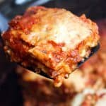

# Lasagna

| Info      | Amount     |
| --------- | ---------- |
| Prep Time | 30 min     |
| Cook Time | 4 h        |
| Yields    | 8 servings |

Added: 2019-03-23

Tags: #pasta #lasagna #vegetarian #dinner

## Ingredients

| Quantity   | Item                                                                    |
| ---------- | ----------------------------------------------------------------------- |
| 500 g      | [ground beef](../_ingredients/ground%20beef.md) (exclude if vegetarian) |
| 3 handfuls | [spinach](../_ingredients/spinach.md) (exclude if carnivorous)          |
| 2 tsp      | [table salt](../_ingredients/table%20salt.md)                           |
| 1 tsp      | [pepper](../_ingredients/pepper.md)                                     |
| 1          | large [onion](../_ingredients/onion.md), chopped                        |
| 1 tsp      | [italian seasoning](../_ingredients/italian%20seasoning.md)             |
| 2 Tbsp     | dried [parsley](../_ingredients/parsley.md)                             |
| 2 tsp      | [garlic powder](../_ingredients/garlic-powder.md)                       |
| 6 oz       | [tomato paste](../_ingredients/tomato%20paste.md)                       |
| 28 oz      | [tomato sauce](../_ingredients/tomato%20sauce.md)                       |
| 5/4 cups   | [water](../_ingredients/water.md)                                       |
| 8 oz       | [lasagna noodles](../_ingredients/lasagna-noodles.md), uncooked         |
| 4 cups     | shredded [mozzarella](../_ingredients/mozzarella.md)                    |
| 3/2 cups   | [ricotta](../_ingredients/ricotta.md)                                   |
| 1/2 cup    | [parmesan](../_ingredients/parmesan.md)                                 |

## Directions

1. In a large skillet over medium heat brown the ground beef and onion
2. Add salt, pepper, Italian seasoning, parsley, garlic powder, tomato paste, tomato sauce, sugar, and water
   1. Stir and simmer 15-20 min
3. Spread a fourth of the meat sauce into the bottom of your slow cooker
   1. Arrange a third of the noodles over the sauce (break the noodles to fit, if necessary)
4. Combine the mozzarella, cottage cheese and parmesan cheese in a medium bowl
   1. Spoon a third of the mixture over noodles
5. Repeat layers twice
6. Top with remaining meat sauce and sprinkle with extra mozzarella cheese, if desired
7. Cover and cook on low for about 4-5 hours or until noodles are tender

## References & Notes

1. [Original recipe](https://tastesbetterfromscratch.com/slow-cooker-lasagna/)
2. Substitute ground beef with 3 handfuls of spinach, if making vegetarian
