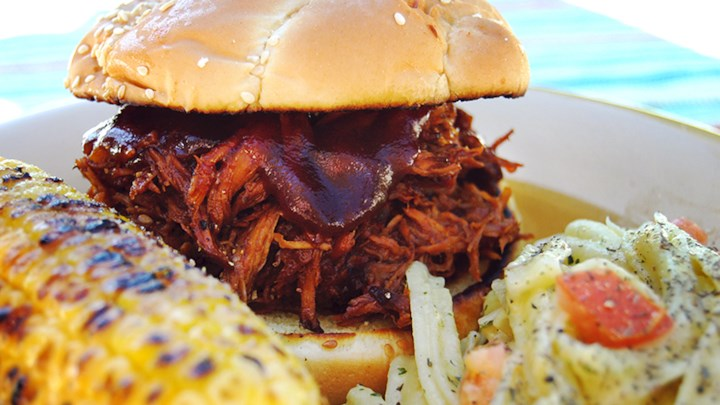

# Pulled pork

| Info      | Amount     |
| --------- | ---------- |
| Prep Time | 15 min     |
| Cook Time | 5 h        |
| Yields    | 8 servings |

Added: 2017-12-03

Tags: #pork #slow-cooker #dinner

## Ingredients

| Quantity | Item                                                              |
| -------- | ----------------------------------------------------------------- |
| 1 tsp    | [vegetable oil](../_ingredients/vegetable%20oil.md)               |
| 4 lbs    | [pork](../_ingredients/pork.md) shoulder roast                    |
| 1 cup    | [barbecue sauce](../_ingredients/barbecue-sauce.md)               |
| 1/2 cup  | [apple cider vinegar](../_ingredients/apple%20cider%20vinegar.md) |
| 1/2 cup  | [chicken broth](../_ingredients/chicken%20broth.md)               |
| 1/4 cup  | [light brown sugar](../_ingredients/brown%20sugar.md)             |
| 1 Tbsp   | [mustard](../_ingredients/mustard.md)                             |
| 1 Tbsp   | [Worcestershire sauce](../_ingredients/Worcestershire-sauce.md)   |
| 1 Tbsp   | [chili powder](../_ingredients/chili%20powder.md)                 |
| 1        | large [onion](../_ingredients/onion.md), diced                    |
| 2 cloves | [garlic](../_ingredients/garlic.md), minced                       |
| 2/3 tsp  | dried [thyme](../_ingredients/thyme.md)                           |
| 8        | [hamburger buns](../_ingredients/hamburger-buns.md)               |

## Directions

1. Pour vegetable oil into bottom of slow cooker
   1. Place in pork roast
   2. Pour in barbecue sauce, apple cider vinegar, and chicken broth
   3. Stir in brown sugar, mustard, Worcestershire sauce, chili powder, onion, garlic, and thyme
   4. Cover and cook on high until pork easily shreds with a fork (5-6 h)
2. Remove roast from slow cooker and shred meat with two forks
   1. Return shredded pork to slow cooker to stir meat into the juices
3. Serve on hamburger buns
