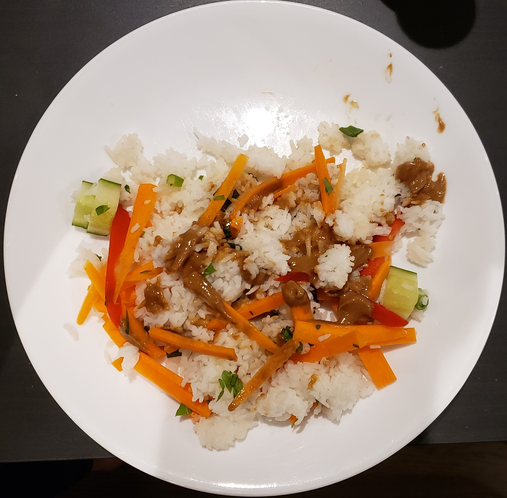

# Thai veggie bowl

| Info      | Amount     |
| --------- | ---------- |
| Prep Time | 25 min     |
| Cook Time | 10 min     |
| Yields    | 4 servings |

Added: 2020-03-13

Tags: #vegetarian #vegan #dinner

## Ingredients

### Thai peanut sauce

| Quantity | Item                                                |
| -------- | --------------------------------------------------- |
| 1 clove  | [garlic](../_ingredients/garlic.md), minced         |
| 2 Tbsp   | [olive oil](../_ingredients/olive%20oil.md)         |
| 3 Tbsp   | [peanut butter](../_ingredients/peanut%20butter.md) |
| 2 tsp    | [ginger](../_ingredients/ginger.md), grated         |
| 3 Tbsp   | [lime juice](../_ingredients/lime%20juice.md)       |
| 3 Tbsp   | [soy sauce](../_ingredients/soy%20sauce.md)         |
| 1 tsp    | [sugar](../_ingredients/sugar.md)                   |

### Salad

| Quantity | Item                                                       |
| -------- | ---------------------------------------------------------- |
| 1 cup    | [rice](../_ingredients/rice.md)                            |
| 16 oz    | [edamame beans](../_ingredients/edamame.md)                |
| 1        | red [bell pepper](../_ingredients/bell%20pepper.md), diced |
| 1/2      | [cucumber](../_ingredients/cucumber.md), diced             |
| 1        | [carrot](../_ingredients/carrot.md), juilienned            |
| 4        | [green onions](../_ingredients/green%20onion.md)           |
| 1/4 cup  | [parsley](../_ingredients/parsley.md), chopped             |
|          | [olive oil](../_ingredients/olive%20oil.md)                |
|          | [sesame seeds](../_ingredients/sesame%20seeds.md)          |

## Directions

1. In a food processor, combine all sauce ingredients and blend until smooth
2. Cooke the rice/soba noodles according to instructions
   1. If noodles, drain, rinse under cold water, toss with olive oil
   2. Transfer to a large bowl
3. Add remaining salad ingredients
4. Top with sauce and sesame seeds when serving

## References & Notes

1. Original recipe: Oh She Glows
