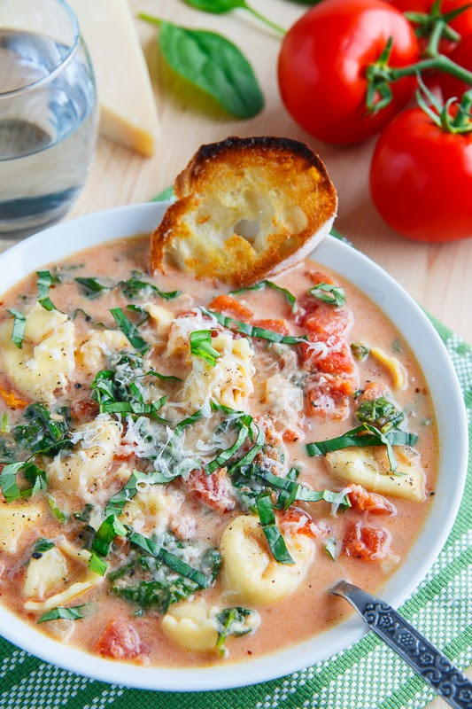

# Tomato spinach tortellini soup

| Info      | Amount     |
| --------- | ---------- |
| Prep Time | 10 min     |
| Cook Time | 20 min     |
| Yields    | 4 servings |

Added: 2020-10-20

Tags: #soup #pasta #vegetarian #dinner

## Ingredients

| Quantity | Item                                                                                                         |
| -------- | ------------------------------------------------------------------------------------------------------------ |
| 2 Tbsp   | [butter](../Ingredients/butter.md)                                                                           |
| 1        | [onion](../Ingredients/onion.md), diced                                                                      |
| 2 cloves | [garlic](../Ingredients/garlic.md), chopped                                                                  |
| 1/4 cup  | [flour](../Ingredients/flour.md)                                                                             |
| 3 cups   | [vegetable broth](../Ingredients/vegetable%20broth.md) or [chicken broth](../Ingredients/chicken%20broth.md) |
| 28 oz    | [diced tomatoes](../Ingredients/diced%20tomatoes.md)                                                         |
| 2 Tbsp   | [tomato paste](../Ingredients/tomato%20paste.md)                                                             |
| 8 oz     | cheese [tortellini](../Ingredients/tortellini.md)                                                            |
| 1/2 cup  | [parmesan](../Ingredients/parmesan.md), grated                                                               |
| 10 oz    | [spinach](../Ingredients/spinach.md), coarsely chopped                                                       |
| 1/2 cup  | [whipping cream](../Ingredients/whipping%20cream.md) or [Greek yogurt](../Ingredients/greek%20yogurt.md)     |
| 1/4 cup  | [basil](../Ingredients/basil.md), chopped (optional)                                                         |
|          | [salt](../Ingredients/salt.md)                                                                               |
|          | [pepper](../Ingredients/pepper.md)                                                                           |
|          | [red pepper flakes](../Ingredients/red%20pepper%20flakes.md)                                                 |

## Directions

1. Melt the butter in a pan over medium heat
   1. add the onion and cook until tender, about 5-7 min
   2. Add the garlic and red pepper flakes and cook until fragrant, about 1 min
   3. Add the flour and cook for another minute
2. Add the broth, tomatoes, tomato paste and tortellini, bring to a boil
   1. Reduce the heat and simmer until the tortellini is tender, about 10 min
3. Add the parmesan, let it melt
   1. Add the spinach, let it wilt
   2. Add the cream, season with salt and pepper to taste
   3. Remove from heat before adding the basil

## References & Notes

1. [Original recipe](https://www.closetcooking.com/creamy-parmesan-tomato-and-spinach/)
