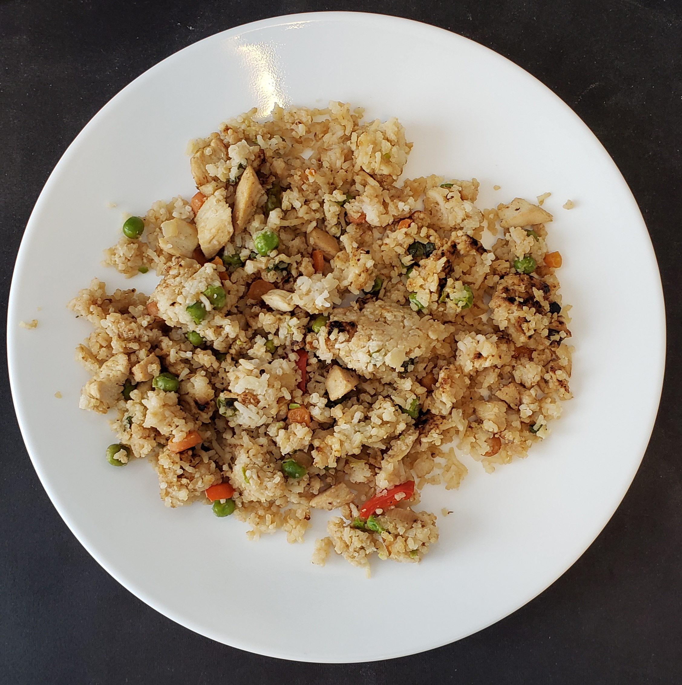

# Chicken fried rice

| Info      | Amount     |
| --------- | ---------- |
| Prep Time | 5  min     |
| Cook Time | 10 min     |
| Yields    | 4 servings |

Added: 2020-07-12

Tags: #chicken #dinner

## Ingredients

| Quantity | Item                                                         |
| -------- | ------------------------------------------------------------ |
| 3 Tbsp   | [butter](../_ingredients/butter.md)                          |
| 2        | [eggs](../_ingredients/eggs.md), lightly beaten              |
| 2        | [carrots](../_ingredients/carrot.md), peeled, diced          |
| 1        | [onion](../_ingredients/onion.md), diced                     |
| 2 cloves | [garlic](../_ingredients/garlic.md), minced                  |
|          | [kosher salt](../_ingredients/kosher-salt.md)                |
|          | [pepper](../_ingredients/pepper.md)                          |
| 4 cup    | [basmati rice](../_ingredients/rice.md), uncooked            |
| 3 stalks | [green onion](../_ingredients/green-onion.md), thinly sliced |
| 3 Tbsp   | [soy sauce](../_ingredients/soy-sauce.md)                    |
| 2 tsp    | [oyster sauce](../_ingredients/oyster-sauce.md)              |
| 2 tsp    | [olive oil](../_ingredients/olive-oil.md)                    |
| 2        | [chicken breasts](../_ingredients/chicken-breast.md)         |

## Directions

1. Cook the rice according to package directions
   1. Place on plate and set aside to cool completely
   2. Once cooled, break it up with your hands into individual grains
2. Heat 1/2 Tbsp butter in a large pan or wok over medium-high heat.
   1. Add eggs, cook until scrambled.
   2. Place egg on a separate plate.
3. Turn heat to medium, add and heat oil, placing chicken breast in the skillet
   1. Cook 3 minutes on each side
   2. Transfer the chicken to a cutting board, cut into very thin slices
4. Add remaining butter, diced onion, carrot, and garlic.
   1. Season with salt and pepper  and cook until soft.
   2. Add rice, green onion, soy sauce, and oyster sauce.
   3. Turn heat to high, fry for another 5 min, stirring as needed.
   4. Add eggs and diced chicken back, stirring all together.

## References & Notes

[^1]: [Original recipe](https://www.gimmesomeoven.com/fried-rice-recipe/print-recipe/62154/)

[^2]: Will last in a refrigerated container for 3 days.
