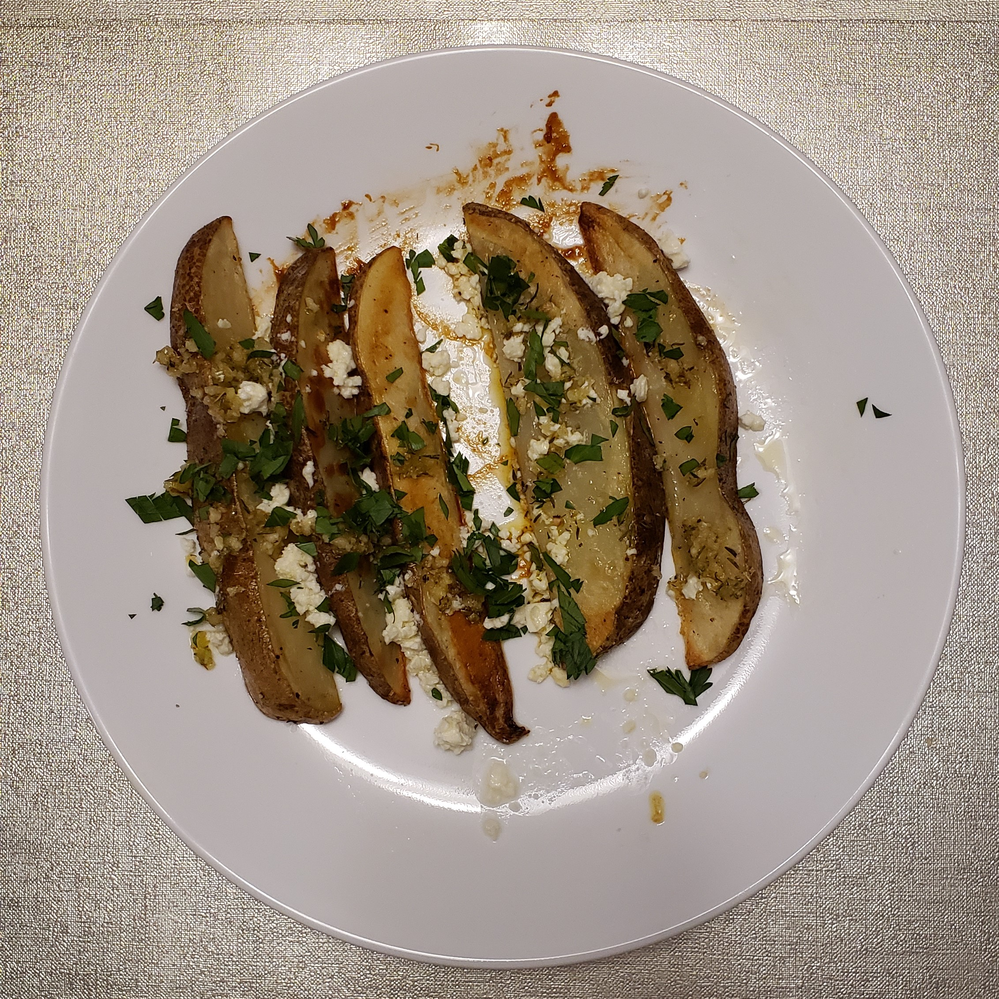

# Greek fries

| Info      | Amount     |
| --------- | ---------- |
| Prep Time | 10 min     |
| Cook Time | 40 min     |
| Yields    | 3 servings |

Added: 2021-02-26

Tags: #appetizer #potato #fries

## Ingredients

| Quantity  | Item                                                |
| --------- | --------------------------------------------------- |
| 6 Tbsp    | [olive oil](../_ingredients/olive-oil.md), divided  |
| 3         | large [Russet potatoes](../_ingredients/potato.md)  |
| 3 cloves  | [garlic](../_ingredients/garlic.md), minced         |
|           | [kosher salt](../_ingredients/kosher-salt.md)       |
|           | [pepper](../_ingredients/pepper.md)                 |
|           | [thyme](../_ingredients/thyme.md)                   |
|           | [oregano](../_ingredients/oregano.md)               |
|           | [cayenne pepper](../_ingredients/cayenne-pepper.md) |
|           | [feta](../_ingredients/feta.md), crumbled           |
| 1 handful | [parsley](../_ingredients/parsley.md)               |
|           | [Tzatziki sauce](../tzatziki-sauce.md)              |

## Directions

1. Preheat oven to 400 F
2. Slice potatoes into 6 - 8 wedges each, then place into a large bowl of hot water for 10 min
    1. Drain and spread wedges on a large clean towel
    2. Pat dry
3. Transfer wedges to a large mixing bowl
    1. Season generously with salt and pepper
    2. Drizzle with half the olive oil
    3. Toss to combine
4. Spread wedges on a lightly oiled bakign sheet in a single layer
    1. Bake in oven for 20 min
    2. Flip wedges, then return for another 15 - 25 min
    3. Transfer to serving platter
5. In a small bowl, combine remaining olive oil, garlic, thyme, oregano, and cayenne
    1. Drizzle oil mixture over the wedges
    2. Crumble feta and sprinkle fresh parsley over top
    3. Serve with a side of tzatziki sauce

## References & Notes

[^1]: [Original recipe](https://www.themediterraneandish.com/greek-style-oven-fries/)

[^2]: Do not skip soaking the potato wedges in hot water, this helps get rid of the starch so that they potatoes don't stick to the pan.

[^3]: Leftovers can be stored in the fridge in a container for 3 - 4 days.
