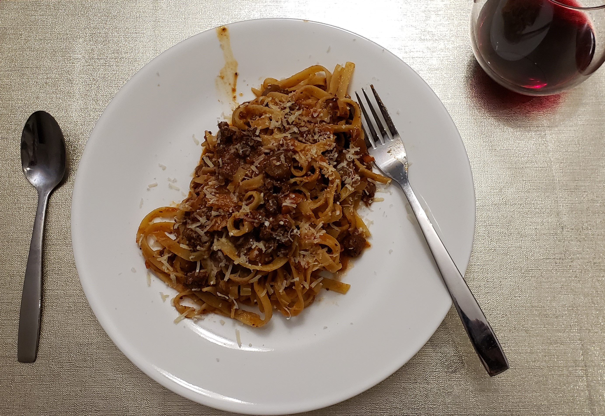

# Pasta al ragu

Pasta in bolognese sauce

| Info      | Amount     |
| --------- | ---------- |
| Prep Time | 20 min     |
| Cook Time | 6 h        |
| Yields    | 6 servings |

Added: 2020-11-01

Tags: #pasta #dinner

## Ingredients

| Quantity | Item                                                                       |
| -------- | -------------------------------------------------------------------------- |
| 1/2      | [red onion](../_ingredients/red%20onion.md), finely diced                  |
| 1        | [carrot](../_ingredients/carrot.md), finely diced                          |
| 2 stalks | [celery](../_ingredients/celery.md), finely diced                          |
| 1 clove  | [garlic](../_ingredients/garlic.md), finely diced                          |
| 400 g    | medium [ground beef](../_ingredients/ground%20beef.md)                     |
| 250 g    | [ground pork](../_ingredients/ground-pork.md)                              |
| 750 mL   | [red wine](../_ingredients/red-wine.md)                                    |
| 2 Tbsp   | [tomato paste](../_ingredients/tomato%20paste.md)                          |
| 800 g    | finely [diced tomatoes](../_ingredients/diced%20tomatoes.md) (Mutti Polpa) |
| 3 Tbsp   | [olive oil](../_ingredients/olive%20oil.md)                                |
| 500 g    | [tagliatelle](../_ingredients/tagliatelle.md)                              |
|          | [parmesan](../_ingredients/parmesan.md)                                    |
|          | [kosher salt](../_ingredients/kosher%20salt.md)                            |
|          | [pepper](../_ingredients/pepper.md)                                        |
|          | [thyme](../_ingredients/thyme.md)                                          |

## Directions

1. In a large sauce pan add 3 Tbsp of olive oil and the soffritto
    1. Season with salt, pepper, and thyme
    2. Let the soffritto cook on high heat until everything is _appassito_, meaning that the colors are not bright anymore, but going towards the yellow
2. Add ground pork
    1. If using bangers, remove them from the casing
    2. Keep mixing and breaking the pork with a wooden spoon
    3. When almost half of the pork changes color, add the ground beef
    4. Keep the gas high and keep mixing and breaking the meats as much as you can
3. Once all the meats change colour add the wine and let the alcohol completely evaporate
    1. You know when the alcohol is gone when the smell is only aromatic and does not "hit" your nose. Or just wait to reduce the liquid by half
4. Add the tomato paste and mix
    1. Cook for 2-3 min (you need to cook out the paste otherwise it will turn more sour)
    2. Add tomato sauce
    3. Season with salt, pepper, and thyme (stay light on the thyme, it is an aroma you want in the sauce)
    4. Taste to the correct seasoning (liquid will reduce so the flavour will intensify)
5. Bring up the sauce to a boil, then reduce to the lowest setting, maintaining a gentle boil
    1. Cover and let the sauce cook for 6 h (the more the better)
    2. Stir every 20-30 min
6. If after 2-3 h the sauce is still very liquid, simmer without a covert to facilitate evaporation
    1. If you do this, mix the sauce every 15 min to make sure it does not reduce too much.
7. Cook tortiglioni or tagliatelle _al dente_
8. Be generous with the sauce and serve with a freshly grated parmesan cheese

## References & Notes

[^1]: Original recipe: Giacomo Grillo
> I am very proud and in love with this sauce.
> I played soccer since I was 7 years-old until I was 23 and every Sunday it was game-day.
> I used to eat this pasta (with variations that my dad threw in) every Sunday, so I can tell that I know this sauce very well!
> When I left Italy and started cooking for me and my friends I found my recipe and flavors.
> The longer you cook this sauce, the better.
> I normally cook it for the next day, leaving it on the stove for 6-8 hours, turning and mixing every 30 minutes.
> The same sauce can be used to prepare lasagna as well.

[^2]: Prepare it as a _soffritto_: very finely diced onion, celery, carrot, and garlic

[^3]: Not an expensive wine!

[^4]: Be careful when cooking the soffritto.
Soffritto is the base of the sauce, if it burns the entire sauce will be ruined.

[^5]: Tortiglioni is acceptable, but tradition would say to serve with tagliatelle
