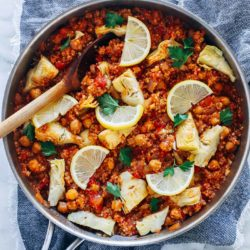

# Spanish quinoa

| Info      | Amount     |
| --------- | ---------- |
| Prep Time | 10 min     |
| Cook Time | 20 min     |
| Yields    | 4 servings |

Added: 2020-05-21

Tags: #rice #vegetarian #bowl #dinner

## Ingredients

| Quantity | Item                                                                        |
| -------- | --------------------------------------------------------------------------- |
| 1 Tbsp   | [olive oil](../_ingredients/olive-oil.md)                                   |
| 1        | small yellow [onion](../_ingredients/onion.md), finely diced                |
| 3 cloves | [garlic](../_ingredients/garlic.md), minced                                 |
| 2 tsp    | [paprika](../_ingredients/paprika.md)                                       |
| 1 tsp    | [cumin](../_ingredients/cumin.md)                                           |
| 1 tsp    | [oregano](../_ingredients/oregano.md)                                       |
| 1/4 tsp  | [cayenne pepper](../_ingredients/cayenne-pepper.md)                         |
| 1/2 tsp  | [table salt](../_ingredients/table-salt.md)                                 |
| 1 cup    | [quinoa](../_ingredients/quinoa.md), uncooked                               |
| 15 oz    | [diced tomatoes](../_ingredients/diced-tomatoes.md)                         |
| 15 oz    | [chickpeas](../_ingredients/chickpeas.md), drained, rinsed                  |
| 2 cups   | [vegetable broth](../_ingredients/vegetable-broth.md)                       |
| 15 oz    | [artichoke hearts](../_ingredients/artichoke-hearts.md), quartered, drained |
| 1        | [lemon](../_ingredients/lemon.md)                                           |
|          | [parsley](../_ingredients/parsley.md)                                       |

## Directions

1. In a large skillet, heat olive oil over medium heat
   1. Add onion, garlic, cumin, oregano, cayenne, and salt
   2. Saute until onion is translucent
2. Add quinoa, diced tomatoes with juices, chickpeas, and vegetable broth
   1. Bring to a low boil
   2. Cover with lid and simmer for 20-30 min, stirring intermittently
3. Stir in artichoke hearts until heated through
4. Garnish with juice from one lemon and fresh parsley

## References & Notes

[^1]: [Original recipe](https://www.makingthymeforhealth.com/one-pot-spanish-quinoa/print/)
