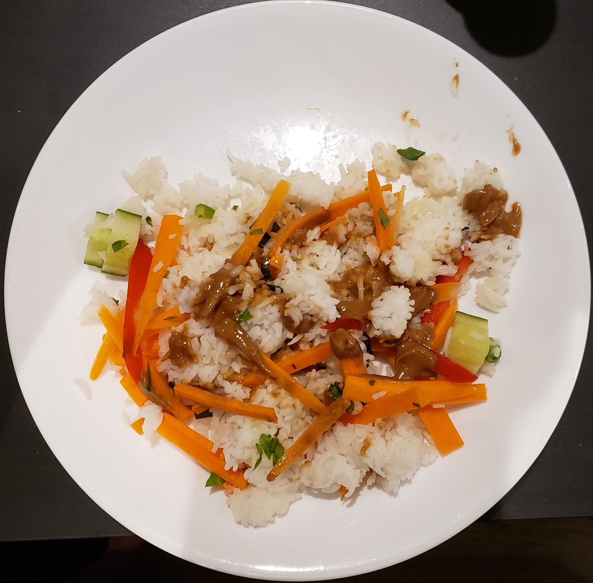

# Thai veggie bowl

| Info      | Amount     |
| --------- | ---------- |
| Prep Time | 25 min     |
| Cook Time | 10 min     |
| Yields    | 4 servings |

Added: 2020-03-13

Tags: #vegetarian #vegan #dinner

## Ingredients

### Thai peanut sauce

| Quantity | Item                                              |
| -------- | ------------------------------------------------- |
| 1 clove  | [garlic](../_ingredients/garlic.md), minced       |
| 2 Tbsp   | [olive oil](../_ingredients/olive-oil.md)         |
| 3 Tbsp   | [peanut butter](../_ingredients/peanut-butter.md) |
| 2 tsp    | [ginger](../_ingredients/ginger.md), grated       |
| 3 Tbsp   | [lime juice](../_ingredients/lime-juice.md)       |
| 3 Tbsp   | [soy sauce](../_ingredients/soy-sauce.md)         |
| 1 tsp    | [sugar](../_ingredients/sugar.md)                 |

### Salad

| Quantity | Item                                                     |
| -------- | -------------------------------------------------------- |
| 1 cup    | [rice](../_ingredients/rice.md)                          |
| 16 oz    | [edamame beans](../_ingredients/edamame.md)              |
| 1        | red [bell pepper](../_ingredients/bell-pepper.md), diced |
| 1/2      | [cucumber](../_ingredients/cucumber.md), diced           |
| 1        | [carrot](../_ingredients/carrot.md), juilienned          |
| 4        | [green onions](../_ingredients/green-onion.md)           |
| 1/4 cup  | [parsley](../_ingredients/parsley.md), chopped           |
|          | [olive oil](../_ingredients/olive-oil.md)                |
|          | [sesame seeds](../_ingredients/sesame-seeds.md)          |

## Directions

1. In a food processor, combine all sauce ingredients and blend until smooth
2. Cooke the rice/soba noodles according to instructions
   1. If noodles, drain, rinse under cold water, toss with olive oil
   2. Transfer to a large bowl
3. Add remaining salad ingredients
4. Top with sauce and sesame seeds when serving

## References & Notes

[^1]: [Original recipe](https://ohsheglows.com/book/)
